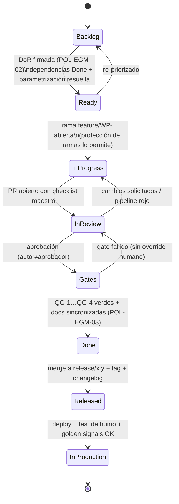
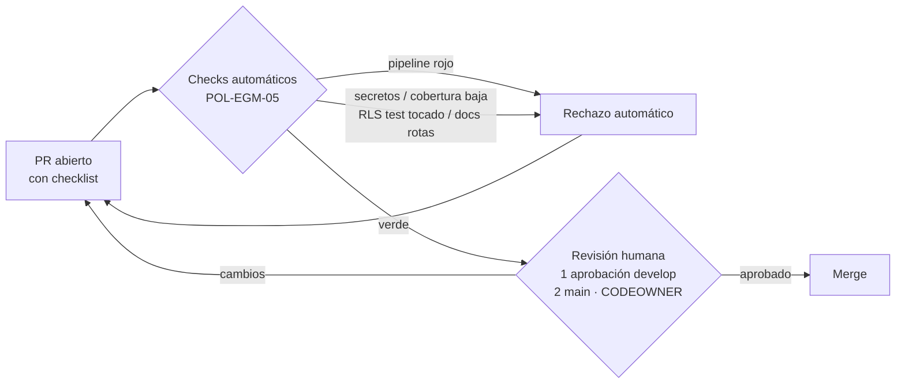
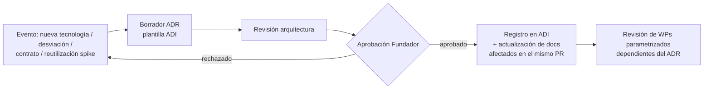
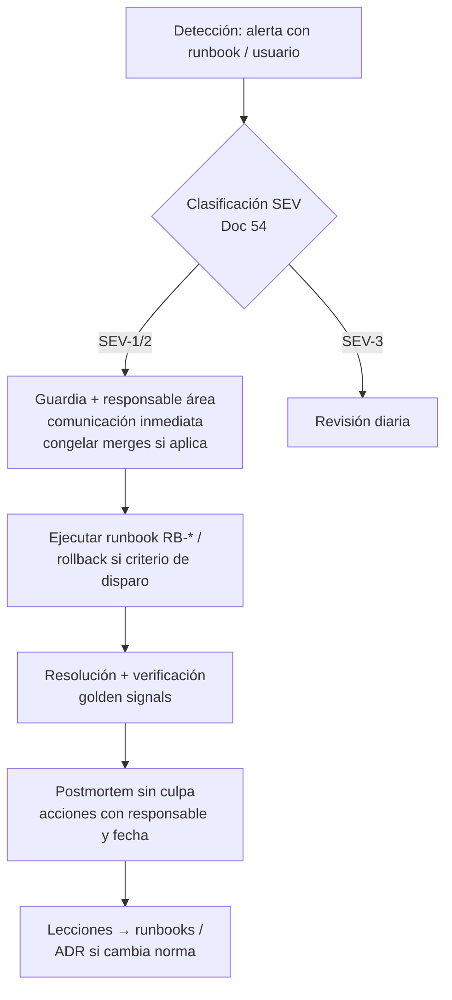
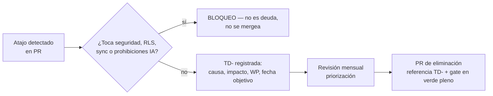

# EGM — 02: Diagramas de Flujo Operativos

**Norma:** DC-14 (POL-EGM-01/05/06/11/12). Los gates los ejecuta CI; no tienen override humano salvo incidente con ADR posterior.

## 1. Ciclo de vida de un Work Package

## 2. Flujo de Pull Request

## 3. Flujo de ADR

## 4. Flujo de Incidente

## 5. Flujo de Deuda Técnica

