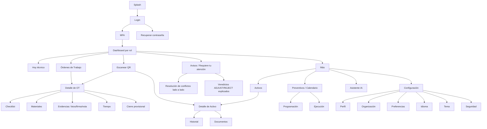

# WP-UX-ART — 01: Mapa de Navegación y User Flows

**Naturaleza:** Design Artifact PRE-GO — no implementación, no MVP, no demo funcional. Vinculado a DC-13/DC-14.
**Fuentes:** Doc 40 (DS-1…DS-9), Doc 16 (journeys), Doc 22 (WA-*), Doc 23 §responsive (DS-3), Doc 18/19 (roles/permisos).

## 1. Mapa de navegación (mermaid)

**Barra inferior móvil (DS-3, S <640px):** [Hoy] [Órdenes] [Escanear] [Avisos] [Más] — targets ≥44pt (RNF-ACC-002), usable con guantes (RNF-USE-003).

## 2. User flows principales

### UF-1 — J-2 (firma del producto): OT offline con conflicto
Login → Hoy → abrir OT asignada → **modo avión** → checklist (4 ítems) → nota → 3 fotos → firma → consumir 2 repuestos → cierre provisional (todo con `SyncBadge` provisional) → **reconexión** → sync → 1 veredicto REJECT (supervisor canceló) → bandeja "Requiere tu atención" → explicación en lenguaje claro → acción (corregir/reasignar/escalar). Trazabilidad: Doc 16 J-2, RF-WO-001…008, RNF-SYNC-005, DS-8.

### UF-2 — Revisión de veredicto ADJUST
Avisos → veredicto ADJUST → "qué cambió el servidor y por qué" → aceptar. Nada desaparece en silencio (DS-8.3).

### UF-3 — Conflicto lado a lado (DS-8.4)
Avisos → conflicto → comparación mi versión / servidor → elegir → confirmar. Prohibido LWW silencioso (Doc 14).

### UF-4 — Escaneo QR en campo (RF-WO-006, RF-REQ-001)
Escanear → activo identificado → "crear solicitud" o "ver OT abiertas del activo".

### UF-5 — IA con y sin conexión (AIA-8, RNF-AI-005, P-33)
Detalle OT → sugerencia IA (etiquetada como IA, con cita) → sin conexión: "las sugerencias IA se generarán al sincronizar", el flujo nunca se bloquea (DS-8.5).

## 3. Inventario de pantallas (resumen; fichas completas en `09_Fichas_Pantallas.md`)

| # | Pantalla | Archivo prototipo | Rol | Flujo |
|---|---|---|---|---|
| P-01 | Splash | `index.html` | todos | entrada |
| P-02 | Login | `login.html` | todos | auth |
| P-03 | MFA | `mfa.html` | todos | auth |
| P-04 | Recuperar contraseña | `recuperar.html` | todos | auth |
| P-05 | Dashboard Técnico | `dashboard.html` | técnico | Hoy |
| P-06 | Lista OT (filtros/búsqueda/prioridad/estado) | `ordenes.html` | técnico/sup | Órdenes |
| P-07 | Detalle OT — checklist/materiales/tiempo/evidencias/firma/comentarios | `orden.html` | técnico | J-2 |
| P-08 | Offline + cola de sync + cambios pendientes | `offline.html` | todos | DS-8 |
| P-09 | Bandeja "Requiere tu atención" (veredictos) | `avisos.html` | técnico | UF-1/2 |
| P-10 | Resolución de conflicto lado a lado | `conflicto.html` | técnico/sup | UF-3 |
| P-11 | Activos (lista/detalle/historial/documentos) | `activos.html` | todos | Activos |
| P-12 | Preventivos (calendario/programación) | `preventivos.html` | sup/admin | Preventivos |
| P-13 | Asistente IA (recomendación con cita) | `ia.html` | todos | UF-5 |
| P-14 | Configuración (perfil/org/preferencias/idioma/tema/seguridad) | `configuracion.html` | todos | Config |
| P-15 | Estados (catálogo DS-7: loading/empty/error/permission/sin resultados) | `estados.html` | — | transversal |

**Cobertura de estados por pantalla:** normal · vacía · error · offline · sin permisos · sin conexión · sin resultados · cargando (DS-7; ejemplos navegables en `estados.html`, aplicados en cada pantalla según su ficha).
